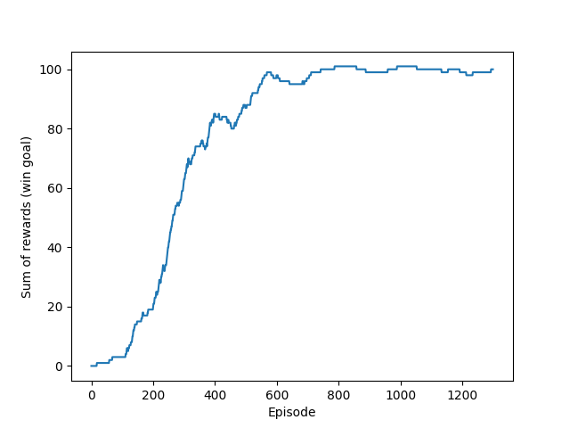

# FrozenLake RL
Solutions for [FrozenLake](https://gymnasium.farama.org/environments/toy_text/frozen_lake/) using Reinforcement Learning.
Success rate is around 60% when slippery=True or 100% otherwise (see [graphs](graphs/)).
  * Q-learning / Deep Q-learning
  * Policy Gradient (Reinforce)
  * Advantage Actor Critic (A2C)
  * Proximal Policy Optimization (PPO)

To run using python 3.12:
```
python3.12 -m venv venv
source venv/bin/activate
pip install -r requirements.txt
```


